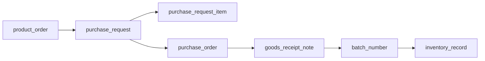

# CRUD API Reference

日期：2026-05-18

資料庫基準：`docs/database/EWDB_20260517_3.sql`

後端基準：

- FastAPI
- SQLAlchemy
- Alembic baseline migration
- API prefix：`/api/v1`

## 目的

本文件整理目前已完成的 MVP CRUD API，並標示它們如何推進採購入庫 workflow。

目前已打通的 CRUD 閉環：



對應 workflow API：

```text
GET /api/v1/workflows/order-to-warehouse/{product_order_no}
```

當完整建立上述資料鏈後，workflow 應回傳：

```json
{
  "complete": true,
  "missing_steps": []
}
```

## 目前已完成 API

| 模組 | Endpoint Prefix | 查詢鍵 | 狀態 |
| --- | --- | --- | --- |
| 訂單 | `/api/v1/product-orders` | `no` | 已完成 |
| 採購需求 | `/api/v1/purchase-requests` | `no` | 已完成 |
| 採購需求明細 | `/api/v1/purchase-requests/{no}/items` | `item_id` | 已完成 |
| 採購單 | `/api/v1/purchase-orders` | `no` | 已完成 |
| 收貨單 | `/api/v1/goods-receipt-notes` | `no` | 已完成 |
| 批號 | `/api/v1/batch-numbers` | `no` | 已完成 |
| 庫存紀錄 | `/api/v1/inventory-records` | `id` | 已完成 |

## 1. Product Orders

資料表：`product_order`

Endpoint：

```text
GET    /api/v1/product-orders
POST   /api/v1/product-orders
GET    /api/v1/product-orders/{no}
PATCH  /api/v1/product-orders/{no}
DELETE /api/v1/product-orders/{no}
```

主要欄位：

| 欄位 | 說明 |
| --- | --- |
| `no` | 業務單號，API 視為唯一 |
| `ref_no` | 合約單號 |
| `item_no` | 品項代號 |
| `item_name` | 品項名稱 |
| `count` | 數量 |
| `expectedDate` | 預計日期 |

驗證規則：

- `POST` 時 `no` 必填。
- 重複 `no` 回傳 `409 Conflict`。
- 查無資料回傳 `404 Not Found`。

Workflow 推進：

- 建立後，`order-to-warehouse` 的 `product_order.exists = true`。
- 下一個缺漏節點通常會是 `purchase_request`。

## 2. Purchase Requests

資料表：

- `purchase_request`
- `purchase_request_item`

Endpoint：

```text
GET    /api/v1/purchase-requests
POST   /api/v1/purchase-requests
GET    /api/v1/purchase-requests/{no}
PATCH  /api/v1/purchase-requests/{no}
DELETE /api/v1/purchase-requests/{no}

POST   /api/v1/purchase-requests/{no}/items
DELETE /api/v1/purchase-requests/{no}/items/{item_id}
```

主檔主要欄位：

| 欄位 | 說明 |
| --- | --- |
| `no` | 請購單號，API 視為唯一 |
| `product_order_no` | 來源訂單 |
| `date` | 請購日期 |
| `comment` | 備註 |

明細主要欄位：

| 欄位 | 說明 |
| --- | --- |
| `purchase_request_no` | 請購單號 |
| `item_no` | 物料代號 |
| `count` | 需求數量 |
| `expectedDate` | 預計需求日期 |

驗證規則：

- `POST` 時 `no` 必填。
- 重複 `no` 回傳 `409 Conflict`。
- 若提供 `product_order_no`，必須存在於 `product_order.no`，否則回傳 `400 Bad Request`。
- 刪除請購主檔時，會同步刪除其明細。

Workflow 推進：

- 建立主檔後，`purchase_request` 會從 `missing_steps` 移除。
- 建立至少一筆明細後，`purchase_request_items` 會從 `missing_steps` 移除。
- 下一個缺漏節點通常會是 `purchase_order`。

## 3. Purchase Orders

資料表：`purchase_order`

Endpoint：

```text
GET    /api/v1/purchase-orders
POST   /api/v1/purchase-orders
GET    /api/v1/purchase-orders/{no}
PATCH  /api/v1/purchase-orders/{no}
DELETE /api/v1/purchase-orders/{no}
```

主要欄位：

| 欄位 | 說明 |
| --- | --- |
| `no` | 採購單號，API 視為唯一 |
| `purchase_request_no` | 來源請購單 |
| `item_no` | 品項/物料代號 |
| `item_name` | 品項/物料名稱 |
| `count` | 採購數量 |
| `amount` | 金額 |

驗證規則：

- `POST` 時 `no` 必填。
- 重複 `no` 回傳 `409 Conflict`。
- 若提供 `purchase_request_no`，必須存在於 `purchase_request.no`，否則回傳 `400 Bad Request`。

Workflow 推進：

- 建立後，`purchase_order` 會從 `missing_steps` 移除。
- 下一個缺漏節點通常會是 `goods_receipt_note`。

## 4. Goods Receipt Notes

資料表：`goods_receipt_note`

Endpoint：

```text
GET    /api/v1/goods-receipt-notes
POST   /api/v1/goods-receipt-notes
GET    /api/v1/goods-receipt-notes/{no}
PATCH  /api/v1/goods-receipt-notes/{no}
DELETE /api/v1/goods-receipt-notes/{no}
```

主要欄位：

| 欄位 | 說明 |
| --- | --- |
| `no` | 收貨單號，API 視為唯一 |
| `purchase_order_no` | 來源採購單 |
| `item_no` | 收貨品項/物料代號 |
| `item_name` | 收貨品項/物料名稱 |
| `expectedCount` | 預計收貨數量 |
| `checkedCount` | 實收/驗收數量 |
| `amount` | 金額 |

驗證規則：

- `POST` 時 `no` 必填。
- 重複 `no` 回傳 `409 Conflict`。
- 若提供 `purchase_order_no`，必須存在於 `purchase_order.no`，否則回傳 `400 Bad Request`。

Workflow 推進：

- 建立後，`goods_receipt_note` 會從 `missing_steps` 移除。
- 下一個缺漏節點通常會是 `batch_number`。

## 5. Batch Numbers

資料表：`batch_number`

Endpoint：

```text
GET    /api/v1/batch-numbers
POST   /api/v1/batch-numbers
GET    /api/v1/batch-numbers/{no}
PATCH  /api/v1/batch-numbers/{no}
DELETE /api/v1/batch-numbers/{no}
```

主要欄位：

| 欄位 | 說明 |
| --- | --- |
| `no` | 批號，API 視為唯一 |
| `ref_no` | 來源收貨單號 |
| `item_no` | 批號品項/物料代號 |
| `item_name` | 批號品項/物料名稱 |
| `expectedCount` | 預計批號數量 |
| `checkedCount` | 實際批號數量 |
| `validDate` | 有效日期 |

驗證規則：

- `POST` 時 `no` 與 `ref_no` 必填。
- 重複 `no` 回傳 `409 Conflict`。
- `ref_no` 必須存在於 `goods_receipt_note.no`，否則回傳 `400 Bad Request`。

Workflow 推進：

- 建立後，`batch_number` 會從 `missing_steps` 移除。
- 下一個缺漏節點通常會是 `inventory_records`。

## 6. Inventory Records

資料表：`inventory_record`

Endpoint：

```text
GET    /api/v1/inventory-records
POST   /api/v1/inventory-records
GET    /api/v1/inventory-records/{record_id}
PATCH  /api/v1/inventory-records/{record_id}
DELETE /api/v1/inventory-records/{record_id}
```

主要欄位：

| 欄位 | 說明 |
| --- | --- |
| `id` | 庫存紀錄 PK |
| `ref_no` | 來源單號，通常可放收貨單號 |
| `warehouse_no` | 倉庫代號 |
| `warehouse_displayName` | 倉庫名稱 |
| `batchNumber` | 對應批號 |
| `item_no` | 品項/物料代號 |
| `item_name` | 品項/物料名稱 |
| `count` | 數量 |
| `amount` | 金額 |

驗證規則：

- 單筆查詢、更新、刪除使用 `id`，因為 `inventory_record` 無 `no` 欄位。
- 若提供 `batchNumber`，必須存在於 `batch_number.no`，否則回傳 `400 Bad Request`。

Workflow 推進：

- 建立至少一筆對應批號的庫存紀錄後，`inventory_records` 會從 `missing_steps` 移除。
- 若前面所有節點都存在，`order-to-warehouse.complete = true`。

## 完整流程範例

以下是最小閉環建立順序：

```text
POST /api/v1/product-orders
POST /api/v1/purchase-requests
POST /api/v1/purchase-orders
POST /api/v1/goods-receipt-notes
POST /api/v1/batch-numbers
POST /api/v1/inventory-records
GET  /api/v1/workflows/order-to-warehouse/{product_order_no}
```

最小資料關聯：

| 步驟 | 關鍵欄位 |
| --- | --- |
| 建立訂單 | `product_order.no` |
| 建立請購 | `purchase_request.product_order_no = product_order.no` |
| 建立採購單 | `purchase_order.purchase_request_no = purchase_request.no` |
| 建立收貨單 | `goods_receipt_note.purchase_order_no = purchase_order.no` |
| 建立批號 | `batch_number.ref_no = goods_receipt_note.no` |
| 建立庫存紀錄 | `inventory_record.batchNumber = batch_number.no` |

## 測試覆蓋

目前測試檔案：

```text
backend/tests/test_product_orders.py
backend/tests/test_purchase_requests.py
backend/tests/test_purchase_orders.py
backend/tests/test_goods_receipt_notes.py
backend/tests/test_batch_numbers.py
backend/tests/test_inventory_records.py
backend/tests/test_workflows.py
```

目前覆蓋：

- CRUD lifecycle。
- 重複單號防呆。
- 上游關聯不存在時回傳 `400 Bad Request`。
- 查無資料時回傳 `404 Not Found`。
- 每個 CRUD 節點建立後，workflow 的 `missing_steps` 會正確推進。
- 建立完整採購入庫資料鏈後，`order-to-warehouse.complete = true`。

最新驗證結果：

```text
ruff check: passed
pytest: 19 passed
```

## 後續建議

採購入庫 CRUD 閉環已完成。下一階段建議二選一：

1. 補前端串接：將倉儲中心頁面從 mock data 改接這些 CRUD 與 workflow API。
2. 繼續後端閉環：實作生產回報 CRUD，範圍為 `work_order -> production_data -> production_data_input/output/machine/labor`。
