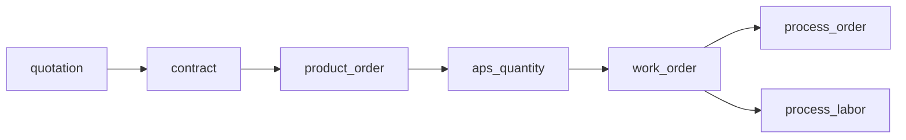
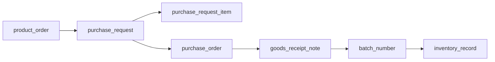
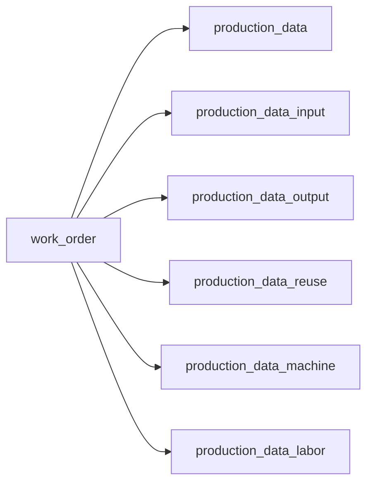

# Workflow API Reference

日期：2026-05-17

資料庫基準：`docs/database/EWDB_20260517_3.sql`

後端實作位置：

- `backend/app/api/v1/endpoints/workflows.py`
- `backend/app/services/workflows.py`
- `backend/app/schemas/workflows.py`
- `backend/tests/test_workflows.py`

## 目的

本文件整理目前已完成的三條 MVP 核心 workflow API，作為後續 CRUD、前端串接、資料驗證與閉環測試的共同對照表。

目前 workflow API 皆回傳：

- `complete`：必要節點是否都已存在。
- `missing_steps`：目前缺少的資料節點。
- `WorkflowRecord`：單一資料節點，包含 `table`、`exists`、`id`、`no`、`label`、`fields`。

## 1. 訂單到生產閉環

Endpoint：

```text
GET /api/v1/workflows/order-to-production/{product_order_no}
```

查詢入口：

- `product_order.no`

資料表鏈：



目前查詢對應：

| 節點 | 查詢條件 | 必要 |
| --- | --- | --- |
| `product_order` | `product_order.no = product_order_no` | 是 |
| `contract` | `contract.no = product_order.ref_no` | 是 |
| `quotation` | `quotation.no = contract.ref_no` | 是 |
| `aps_quantity` | `aps_quantity.product_order_no = product_order_no` | 是 |
| `work_order` | `work_order.product_order_no = product_order_no` | 是 |
| `process_order` | `process_order.work_order_no = work_order.no` | 是 |
| `process_labor` | `process_labor.work_order_no = work_order.no` | 是，至少一筆 |

主要用途：

- 確認客戶需求是否已轉成 APS 排程與正式工單。
- 確認工單是否已有製程派工與人員配置。
- 支撐生產中心的工單狀態、排程狀態與流程斷點提示。

## 2. 訂單到採購入庫閉環

Endpoint：

```text
GET /api/v1/workflows/order-to-warehouse/{product_order_no}
```

查詢入口：

- `product_order.no`

資料表鏈：



目前查詢對應：

| 節點 | 查詢條件 | 必要 |
| --- | --- | --- |
| `product_order` | `product_order.no = product_order_no` | 是 |
| `purchase_request` | `purchase_request.product_order_no = product_order_no` | 是 |
| `purchase_request_item` | `purchase_request_item.purchase_request_no = purchase_request.no` | 是，至少一筆 |
| `purchase_order` | `purchase_order.purchase_request_no = purchase_request.no` | 是 |
| `goods_receipt_note` | `goods_receipt_note.purchase_order_no = purchase_order.no` | 是 |
| `batch_number` | `batch_number.ref_no = goods_receipt_note.no` | 是 |
| `inventory_record` | `inventory_record.batchNumber = batch_number.no` | 是，至少一筆 |

主要用途：

- 確認訂單需求是否已轉成採購需求。
- 確認採購單、收貨單、批號與庫存紀錄是否形成完整入庫閉環。
- 支撐倉儲中心的庫存 KPI、批號追蹤、效期追蹤與入庫任務狀態。

## 3. 工單到生產回報閉環

Endpoint：

```text
GET /api/v1/workflows/work-order-production-report/{work_order_no}
```

查詢入口：

- `work_order.no`

資料表鏈：



目前查詢對應：

| 節點 | 查詢條件 | 必要 |
| --- | --- | --- |
| `work_order` | `work_order.no = work_order_no` | 是 |
| `production_data` | `production_data.work_order_no = work_order_no` | 是 |
| `production_data_input` | `production_data_input.work_order_no = work_order_no` | 是，至少一筆 |
| `production_data_output` | `production_data_output.work_order_no = work_order_no` | 是，至少一筆 |
| `production_data_machine` | `production_data_machine.work_order_no = work_order_no` | 是，至少一筆 |
| `production_data_labor` | `production_data_labor.work_order_no = work_order_no` | 是，至少一筆 |
| `production_data_reuse` | `production_data_reuse.work_order_no = work_order_no` | 否 |

備註：

- `production_data_reuse` 目前列為可選節點，因為不是每一張工單都會產生回收或再利用紀錄。
- 若未來品保或成本計算要求每張工單都必須記錄損耗/回收，可再把此節點調整為必要。

主要用途：

- 確認工單是否已完成生產主檔回報。
- 確認投入、產出、設備與人員工時是否已形成完整生產履歷。
- 支撐 OEE、良率、投入產出、物料損耗、人機工時與批號追溯。

## API 回傳判斷規則

`complete = true` 條件：

- 所有必要單筆節點皆存在。
- 所有必要多筆節點至少存在一筆資料。
- 可選節點不存在時，不影響 `complete`。

`missing_steps` 條件：

- 單筆節點不存在時，加入該節點名稱。
- 多筆節點為空陣列時，加入該節點名稱。

## 已完成測試

測試檔案：

```text
backend/tests/test_workflows.py
```

目前覆蓋：

| 測試範圍 | 完整流程 | 缺漏流程 |
| --- | --- | --- |
| 訂單到生產 | 已完成 | 已完成 |
| 訂單到採購入庫 | 已完成 | 已完成 |
| 工單到生產回報 | 已完成 | 已完成 |

最新驗證結果：

```text
ruff check: passed
pytest: 7 passed
```

## 後續 CRUD 開發建議

建議依照閉環順序建立 CRUD 與狀態轉換，而不是一次把所有資料表都做成獨立 CRUD。

優先順序：

1. 建立 `product_order` CRUD 與查詢列表。
2. 建立 `purchase_request`、`purchase_request_item`、`purchase_order`、`goods_receipt_note`、`batch_number`、`inventory_record` 的閉環建立流程。
3. 建立 `work_order` CRUD 與排程/派工狀態。
4. 建立 `production_data` 與投入、產出、設備、人員回報流程。
5. 將 workflow API 接回前端 Dashboard，替代目前 mock data。

每個 CRUD 建議至少補三類測試：

- 建立資料後，workflow API 能從 `missing_steps` 移除對應節點。
- FK 或業務關聯不存在時，API 回傳明確錯誤。
- 重複單號或唯一鍵違反時，API 回傳可讀訊息。

## 前端串接建議

短期可先把三條 workflow API 接到既有 Prototype 的狀態卡：

| 前端模組 | 建議串接 |
| --- | --- |
| 生產中心 | `order-to-production`、`work-order-production-report` |
| 倉儲中心 | `order-to-warehouse` |
| 品保中心 | `work-order-production-report` 的產出批號與投入批號 |
| Dashboard | 三條 API 的 `complete`、`missing_steps` 統計 |

Dashboard 指標可以先從 workflow 結果計算：

- 未排程訂單：`order-to-production.missing_steps` 包含 `aps_quantity` 或 `work_order`。
- 待採購入庫：`order-to-warehouse.complete = false`。
- 生產未回報：`work-order-production-report.missing_steps` 包含 `production_data_outputs`。
- 批號已入庫：`order-to-warehouse.complete = true`。
