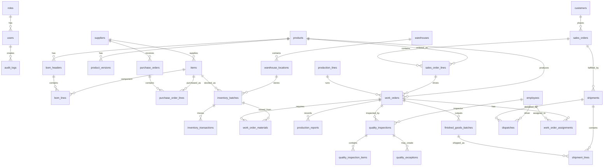

# ERP 2.0 Core ERD Review

來源檔案：`temp/ewdb20260514.sql`

檢視日期：2026-05-14

## 結論

這份 schema 已經涵蓋 ERP / 食品工廠的多數核心領域，包含：

- 客戶、供應商、廠商、人員
- 品項、原料、產品、BOM、製程
- 訂單、採購、工單、排程
- 生產投入、產出、人工、機台
- 倉儲、庫存異動、批號、出貨
- 應收應付、價格、薪資、費用

但若要作為第二階段 MVP 的正式資料庫基礎，建議先整理後再進入 Alembic migration。主要原因：

- 目前沒有宣告 `FOREIGN KEY`，ERD 關聯只能靠欄位名稱推斷。
- 大量欄位同時存 `*_no` 與 `*_displayName`，屬於反正規化快照，容易與主資料不同步。
- 很多日期與時間使用 `int(11)`，建議改為 `DATE` / `DATETIME` / `TIMESTAMP`。
- 數量、重量、價格大量使用 `float`，建議改為 `DECIMAL`。
- 訂單、採購單、出貨單目前偏向一張表一列品項，建議拆成 header / lines。
- 批號、庫存、品檢、出貨可以支援食品追溯，但需要補強明確關聯與狀態流轉。

## 現有核心表分群

### 主資料

| 領域 | 現有表 |
|---|---|
| 客戶 | `customer` |
| 供應商 | `supplier` |
| 廠商/物流/外包 | `vendor`, `ship_wh` |
| 人員 | `employee`, `member`, `user_group` |
| 品項/成品 | `product`, `product_ver`, `product_spec` |
| 原料/包材 | `material` |
| BOM/配方 | `bom`, `bom1`, `bom2`, `product_bom_spec`, `inproduct_bom_spec`, `bom_item` |
| 製程/產線 | `process`, `process_flow`, `product_process`, `production_line`, `station`, `equipment` |
| 倉儲 | `warehouse` |

### 交易資料

| 領域 | 現有表 |
|---|---|
| 客戶訂單 | `product_order` |
| 採購 | `purchase_request`, `purchase_request_item`, `purchase_order` |
| 工單 | `work_order`, `process_order`, `production_schedule` |
| 生產紀錄 | `production_data`, `production_data_input`, `production_data_output`, `production_data_labor`, `production_data_machine`, `production_data_reuse` |
| 庫存 | `inventory_order`, `inventory_record`, `inventory_delta`, `inventory_month_statistic` |
| 批號 | `batch_number`, `batchno_serialno`, `batchno_serialno_group`, `batchno_history` |
| 出貨/物流 | `shipping_order`, `shipping_record`, `shipping_payment`, `shipping_price` |
| 品保/客訴 | `complaints`, `sample` |
| 財務 | `arap`, `payment`, `order_payment`, `expense_order`, `warehouse_payment` |

## 從現有表推斷的核心 ERD

> 注意：原 SQL 沒有實體 FK，以下關聯是依欄位名稱推斷，用於理解現有設計。

```mermaid
erDiagram
    CUSTOMER ||--o{ PRODUCT_ORDER : "item_ref_no / customer"
    CUSTOMER ||--o{ PRODUCT : "customer_no"
    CUSTOMER ||--o{ QUOTATION : "item_ref_no"
    CUSTOMER ||--o{ CONTRACT : "item_ref_no"

    SUPPLIER ||--o{ MATERIAL : "supplier_no"
    SUPPLIER ||--o{ PURCHASE_ORDER : "item_ref_no"
    SUPPLIER ||--o{ PURCHASE_REQUEST : "indirect"

    PRODUCT ||--o{ PRODUCT_VER : "item_no"
    PRODUCT ||--o{ PRODUCT_SPEC : "product_no"
    PRODUCT ||--o{ PRODUCT_ORDER : "item_no"
    PRODUCT ||--o{ WORK_ORDER : "product_no"
    PRODUCT ||--o{ PRODUCT_PROCESS : "item_no"

    MATERIAL ||--o{ PURCHASE_REQUEST_ITEM : "material_id"
    MATERIAL ||--o{ PURCHASE_ORDER : "item_no"
    MATERIAL ||--o{ INVENTORY_RECORD : "item_no"
    MATERIAL ||--o{ PRODUCTION_DATA_INPUT : "item_no"

    BOM ||--o{ BOM1 : "parent_no"
    BOM ||--o{ BOM2 : "parent_no"
    BOM ||--o{ PRODUCT_BOM_SPEC : "bom2_no"

    PRODUCT_ORDER ||--o{ WORK_ORDER : "product_order_no"
    PRODUCT_ORDER ||--o{ PURCHASE_REQUEST : "product_order_id"
    PRODUCT_ORDER ||--o{ SHIPPING_ORDER : "product_order_no"
    PRODUCT_ORDER ||--o{ APS_QUANTITY : "product_order_no"

    PURCHASE_REQUEST ||--o{ PURCHASE_REQUEST_ITEM : "purchase_request_id"
    PURCHASE_REQUEST ||--o{ PURCHASE_ORDER : "purchase_request_id"

    PRODUCTION_LINE ||--o{ WORK_ORDER : "production_line_no"
    PRODUCTION_LINE ||--o{ PRODUCTION_SCHEDULE : "production_line_id"

    WORK_ORDER ||--o{ PRODUCTION_SCHEDULE : "work_order_id"
    WORK_ORDER ||--o{ PRODUCTION_DATA : "work_order_no"
    WORK_ORDER ||--o{ PRODUCTION_DATA_INPUT : "work_order_no"
    WORK_ORDER ||--o{ PRODUCTION_DATA_OUTPUT : "work_order_no"
    WORK_ORDER ||--o{ PRODUCTION_DATA_LABOR : "work_order_no"
    WORK_ORDER ||--o{ PRODUCTION_DATA_MACHINE : "work_order_no"

    BATCH_NUMBER ||--o{ PRODUCTION_DATA_INPUT : "batch_number"
    BATCH_NUMBER ||--o{ PRODUCTION_DATA_OUTPUT : "batch_number"
    BATCH_NUMBER ||--o{ INVENTORY_RECORD : "batchNumber"
    BATCH_NUMBER ||--o{ BATCHNO_SERIALNO : "batch_number"

    WAREHOUSE ||--o{ INVENTORY_RECORD : "warehouse_no"
    INVENTORY_ORDER ||--o{ INVENTORY_RECORD : "ref_no"
    SHIPPING_ORDER ||--o{ SHIPPING_RECORD : "ref_no"

    EMPLOYEE ||--o{ WORK_ORDER : "creator_id"
    EMPLOYEE ||--o{ PRODUCTION_DATA_LABOR : "employee_no"
    EMPLOYEE ||--o{ COMPLAINTS : "sales_id / QA_id / operator"
```

## Sprint 12 建議 MVP ERD

建議 Sprint 12 不要直接把 124 張表全部搬成正式 v2 schema。先建立一個可支援「訂單 → 工單 → 領料 → 生產 → 品檢 → 入庫 → 出貨 → 批號追蹤」的核心 schema。

## Sprint 12 推薦資料表

### 主資料 Master Data

| 建議表 | 用途 | 可參考現有表 |
|---|---|---|
| `roles` | 角色 | `user_group` |
| `users` | 使用者帳號 | `member`, `employee` |
| `employees` | 員工與班別基礎 | `employee` |
| `customers` | 客戶 | `customer` |
| `suppliers` | 供應商 | `supplier`, `vendor` |
| `items` | 統一品項主檔，成品/原料/包材/半成品 | `product`, `material`, `goods`, `inproduct` |
| `products` | 成品主檔，可視為 `items` 的成品延伸 | `product` |
| `product_versions` | 成品版本 | `product_ver` |
| `bom_headers` | BOM/配方表頭 | `bom` |
| `bom_lines` | BOM 原料/包材/半成品明細 | `bom1`, `bom2`, `product_bom_spec` |
| `warehouses` | 倉庫 | `warehouse` |
| `warehouse_locations` | 庫位 | 目前不足，建議新增 |
| `production_lines` | 產線 | `production_line` |
| `vehicles` | 車輛 | 目前不足，建議新增 |

### 交易資料 Transaction Data

| 建議表 | 用途 | 可參考現有表 |
|---|---|---|
| `sales_orders` | 訂單表頭 | `product_order` |
| `sales_order_lines` | 訂單明細 | `product_order` |
| `purchase_orders` | 採購表頭 | `purchase_order` |
| `purchase_order_lines` | 採購明細 | `purchase_order`, `purchase_request_item` |
| `inventory_batches` | 庫存批號餘額 | `batch_number`, `inventory_record` |
| `inventory_transactions` | 庫存異動流水帳 | `inventory_record`, `inventory_order` |
| `work_orders` | 工單 | `work_order` |
| `work_order_materials` | 工單領料需求/實領 | `production_data_input` |
| `production_reports` | 報工紀錄 | `production_data`, `production_data_output` |
| `quality_inspections` | 品檢單 | 目前不足，`complaints`, `sample` 只能部分參考 |
| `quality_inspection_items` | 品檢項目 | 目前不足，建議新增 |
| `quality_exceptions` | 品質異常/NCR | `complaints` |
| `finished_goods_batches` | 成品批號 | `batch_number`, `production_data_output` |
| `shipments` | 出貨表頭 | `shipping_order` |
| `shipment_lines` | 出貨明細與批號 | `shipping_order`, `shipping_record` |
| `dispatches` | 物流派車 | 目前不足，建議新增 |
| `audit_logs` | 稽核紀錄 | 目前不足，建議新增 |

## 主要修正建議

### 1. 補正式外鍵

目前 SQL 沒有 `FOREIGN KEY`。建議 Sprint 12 開始用 Alembic 明確建立 FK，例如：

- `sales_order_lines.sales_order_id -> sales_orders.id`
- `sales_order_lines.product_id -> products.id`
- `work_orders.sales_order_line_id -> sales_order_lines.id`
- `work_orders.production_line_id -> production_lines.id`
- `inventory_transactions.batch_id -> inventory_batches.id`
- `quality_inspections.work_order_id -> work_orders.id`

### 2. 訂單/採購/出貨改成 header + lines

目前 `product_order`, `purchase_order`, `shipping_order` 比較像一列一品項。MVP 建議：

- `sales_orders`：客戶、訂單日期、交期、狀態
- `sales_order_lines`：品項、數量、單價、交期、關聯 BOM/工單
- `purchase_orders`：供應商、採購日期、狀態
- `purchase_order_lines`：品項、數量、價格、到貨日
- `shipments`：出貨目的地、物流狀態
- `shipment_lines`：出貨品項、批號、數量

### 3. 統一品項模型

現有 `product`, `material`, `goods`, `inproduct` 分散。建議建立 `items` 統一管理：

- `item_type`: `finished_good`, `semi_finished`, `raw_material`, `packaging`
- 成品特有資料可放 `products`
- 採購、庫存、BOM、批號都指向 `items`

### 4. 批號與庫存要拆清楚

目前 `batch_number` 與 `inventory_record` 都有批號資訊。建議：

- `inventory_batches`：目前批號餘額與位置
- `inventory_transactions`：每次入庫/出庫/移倉/調整
- `finished_goods_batches`：成品批號來源工單與品檢狀態

### 5. 品保資料不足，需要正式補表

`complaints` 偏客訴/NCR，`sample` 偏打樣，還不足以支援現場品檢。

建議新增：

- `quality_inspections`
- `quality_inspection_items`
- `quality_exceptions`

### 6. 日期時間欄位改型別

大量欄位如 `date`, `creationTime`, `startTime`, `endTime` 使用 `int(11)`。建議：

- 日期：`DATE`
- 時間點：`DATETIME`
- 建立/更新：`created_at`, `updated_at`
- 若要保留 Unix timestamp，另以 `*_ts` 命名，不作主要查詢欄位。

### 7. 金額與數量改 DECIMAL

目前 `float` / `double` 很多。建議：

- 數量：`DECIMAL(18, 4)`
- 重量：`DECIMAL(18, 4)`
- 金額：`DECIMAL(18, 2)`
- 比率：`DECIMAL(8, 4)`

### 8. 狀態欄位需要字典化

目前多數 `result`, `category`, `type`, `itemCategory` 是 `int`，但沒有對照表。

建議建立：

- `status_code`
- `order_status`
- `work_order_status`
- `quality_status`
- 或至少在程式端 enum 固定。

### 9. 人員、物流派車資料需要補強

現有 `employee` 可作人員基礎，但物流派車還缺：

- `vehicles`
- `drivers` 或 `employees` role = driver
- `dispatches`
- `dispatch_stops`
- `temperature_logs`

## Sprint 12 建議落地順序

1. 建立主資料表：`roles`, `users`, `employees`, `customers`, `suppliers`, `items`, `products`
2. 建立 BOM：`product_versions`, `bom_headers`, `bom_lines`
3. 建立倉儲：`warehouses`, `warehouse_locations`, `inventory_batches`, `inventory_transactions`
4. 建立訂單與工單：`sales_orders`, `sales_order_lines`, `production_lines`, `work_orders`, `work_order_materials`
5. 建立品保：`quality_inspections`, `quality_inspection_items`, `quality_exceptions`
6. 建立出貨：`shipments`, `shipment_lines`, `dispatches`
7. 補 `audit_logs`

## 建議下一步

Sprint 12 可先不要一次移植舊 schema。建議由這份 ERD 產出第一版 Alembic migration，先建立 MVP 核心 schema，再逐步規劃舊表資料如何 migrate 或 map 到新表。
