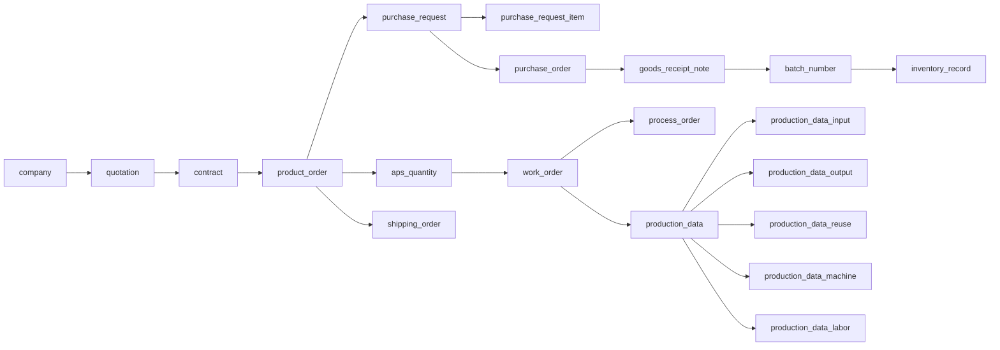

# EWDB 20260521 Database Baseline Review

日期：2026-05-21

基準檔案：`docs/database/EWDB_20260521.sql`

> 備註：需求訊息提到 `EWDB_20265021.sql`，但 GitHub `main` 分支實際檔名為 `EWDB_20260521.sql`。本文件以 `EWDB_20260521.sql` 為準。

## Baseline Summary

`EWDB_20260521.sql` 已從先前 MVP 草案擴展為接近完整營運模型：

| 項目 | 數量 |
| --- | ---: |
| Tables | 80 |
| Unique Keys | 74 |
| Foreign Keys | 119 |
| Engine / Charset | InnoDB / utf8mb4 |

## Domain Groups

| Domain | Tables | Scope |
| --- | ---: | --- |
| Master Data | 19 | 企業、公司、帳戶、品項、人員、會員、裝置 |
| BOM / Product Structure | 7 | BOM、BOM 階層、產品與半成品規格 |
| Inventory / Batch | 11 | 批號、序號、庫存單據、庫存紀錄、庫存統計 |
| Sales | 5 | 報價、合約、銷售訂單、出貨單、訂單收付款 |
| Purchase | 4 | 請購、請購明細、採購單、收貨單 |
| Shipping Warehouse | 6 | 倉租報價/合約、出入倉紀錄、倉租收付款 |
| MES / Production | 16 | 工廠、製程、產線、站點、設備、APS、工單、製程單、報工 |
| Statistics / Capacity | 5 | 訂單月統計、產線人力/品項產能、耗損、工資 |
| Pricing / Process Reference | 7 | 價格、耗損、工時、製程產能、製程流程 |

## Key Workflow Backbone

## Important Design Decisions

- Business keys continue to use `no` style columns and are protected by unique keys in most operational master/header tables.
- The schema preserves EWDB field casing such as `creationTime`, `item_ref_displayName`, `expectedCount`, and `checkedCount`; API schemas should not silently rename these fields without a compatibility layer.
- Financial and quantity fields still use a mix of `INT`, `FLOAT`, and `DECIMAL`-like intent. For production accounting, any new code should avoid adding more `FLOAT` calculations for money.
- Several references are still business-key based (`*_no`) instead of surrogate-key based (`*_id`). Backend services must validate these upstream references before insert/update.
- The schema uses two capitalized inventory statistic table names: `Inventory_month_statistic` and `Inventory_item_month_statistic`. This is a deployment risk on case-sensitive MariaDB/Linux systems.

## ORM Alignment Check

Compared with `restserver/package/dbwrapper/table.py`, the following gaps should be resolved before treating the Python ORM as authoritative:

| Severity | Finding | Evidence |
| --- | --- | --- |
| High | ORM does not define `purchase_request` and `purchase_request_item`, although they are referenced by SQL foreign keys and purchase workflow APIs. | SQL lines 861-883; ORM has no matching `__tablename__` |
| High | SQL uses `Inventory_month_statistic` / `Inventory_item_month_statistic`, while ORM uses lowercase `inventory_month_statistic` / `inventory_item_month_statistic`. | SQL lines 655 and 673; ORM table.py lines 1222 and 1240 |
| Medium | `device_log` SQL has `name`; ORM does not. | SQL line 30; ORM table.py lines 1165-1171 |
| Medium | `warehouse_record` SQL has `ref_no`; ORM has `comment` instead. | SQL line 1002; ORM table.py lines 457-474 |
| Medium | `sample_price` SQL has `comment`; ORM has `itemVer`. | SQL lines 381-397; ORM table.py lines 229-244 |
| Medium | ORM has columns not present in SQL for `item_price`, `aps_quantity_item`, `pl_man_capacity`, and `user_group`. | ORM table.py lines 131-161, 1419-1434, 1530-1543, 789-796 |

## Backend And API Implications

- API reference documents should now cite `docs/database/EWDB_20260521.sql` as the database baseline.
- CRUD implementation should prioritize the schema gaps above before expanding endpoints, especially `purchase_request` / `purchase_request_item`.
- Database migrations should decide whether to normalize the capitalized inventory statistic table names or preserve them and document the operating-system requirement.
- Any UI/domain design that displays modules should align with the nine domain groups in this document.

