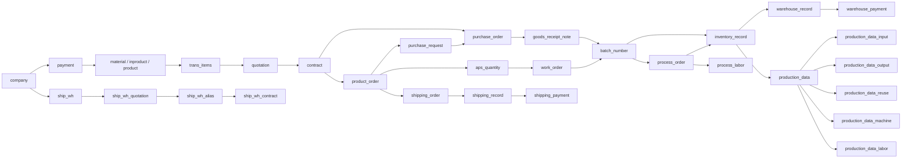

# EWDB 20260522 Workflow Baseline

日期：2026-05-22

資料庫基準：`docs/database/EWDB_20260522.sql`

程式碼基準：`restserver/package`

## Key Workflow Backbone

## Workflow Interpretation

EWDB 20260522 的主流程不是單一採購或單一生產流程，而是以交易主檔、訂單、批號、庫存、製程與付款互相串接的食品工廠作業骨架。

1. 基礎主檔先建立交易對象與品項能力：`company`、`payment`、`material`、`inproduct`、`product`、`trans_items`。
2. 報價與合約形成業務來源：`quotation -> contract`，以及倉儲服務來源 `ship_wh -> ship_wh_quotation -> ship_wh_alias -> ship_wh_contract`。
3. 合約可推動銷售訂單與採購單：`contract -> product_order`、`contract -> purchase_order`。
4. 銷售訂單會同時分流到採購需求、APS/工單、生產出貨：`product_order -> purchase_request`、`product_order -> aps_quantity -> work_order`、`product_order -> shipping_order`。
5. 採購入庫鏈路為 `purchase_request -> purchase_order -> goods_receipt_note -> batch_number -> inventory_record -> warehouse_record -> warehouse_payment`。
6. 生產製造鏈路為 `aps_quantity -> work_order -> batch_number -> process_order -> process_labor`，並由 `process_order` 連回 `inventory_record` 與 `production_data`。
7. 生產回報資料以 `production_data` 為主檔，拆成投入、產出、回收、機台、人工五類明細。
8. 出貨收款鏈路為 `product_order -> shipping_order -> shipping_record -> shipping_payment`。

## Implementation Mapping

| Workflow Area | Primary Tables | restserver Modules |
| --- | --- | --- |
| 主檔與交易品項 | `company`, `payment`, `material`, `inproduct`, `product`, `goods`, `trans_items` | `company`, `material`, `product`, `goods`, `transitems`, `bankaccount` |
| 報價與合約 | `quotation`, `contract`, `ship_wh_quotation`, `ship_wh_contract` | `quotation`, `contract`, `shipwarehouse`, `sale` |
| 採購入庫 | `purchase_request`, `purchase_order`, `goods_receipt_note`, `batch_number`, `inventory_record`, `warehouse_record`, `warehouse_payment` | `purchase`, `batchnumber`, `inventory`, `shipwarehouse`, `arap` |
| 生產排程與工單 | `aps_quantity`, `aps_quantity_item`, `work_order`, `process_order`, `process_labor` | `aps`, `workorder`, `work`, `processorder` |
| 生產回報 | `production_data`, `production_data_input`, `production_data_output`, `production_data_reuse`, `production_data_machine`, `production_data_labor` | `work`, `workorder`, `mes`, `batchtrace` |
| 出貨與收款 | `shipping_order`, `shipping_record`, `shipping_payment` | `sale`, `shipwarehouse`, `arap` |
| 統計 | `inventory_month_statistic`, `inventory_item_month_statistic`, `order_item_month_statistic`, `pl_*` | `statistic`, `plstatistics` |

## Current Confirmation

- `EWDB_20260522.sql` contains 79 tables, 73 unique keys, and 118 foreign-key constraints.
- `restserver/package/dbwrapper/table.py` now defines 79 ORM tables matching the SQL table list.
- ORM unique constraints are aligned with `EWDB_20260522.sql`.
- ORM non-date material column types are aligned with `EWDB_20260522.sql`.
- The previous workflow typo `mateial/inprodcut/product` has been corrected to `material / inproduct / product` in this baseline.

## Notes For Future Work

- `batch_number.ref_no` remains polymorphic by workflow design: it may point to purchasing, work-order, or process-order origins depending on `refCategory`.
- `trans_items` is the commercial transaction item bridge; `material`, `inproduct`, `product`, and `goods` remain the operational item masters.
- Runtime API smoke tests require installing `restserver/package/requirements.txt` and providing MariaDB connection settings from `restserver/package/config/.env.example`.
