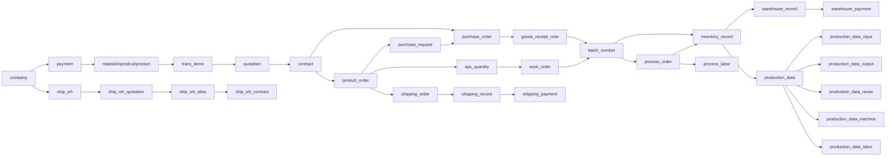

日期：2026-05-21

## Key Workflow Backbone

```mermaid
flowchart LR
  company --> payment --> mateial/inprodcut/product --> trans_items --> quotation --> contract
  company --> ship_wh --> ship_wh_quotation --> ship_wh_alias --> ship_wh_contract

  contract --> product_order
  contract --> purchase_order
  product_order --> purchase_request

  purchase_request --> purchase_order --> goods_receipt_note --> batch_number --> inventory_record --> warehouse_record --> warehouse_payment
  product_order --> aps_quantity --> work_order  --> batch_number --> process_order --> process_labor


  process_order --> inventory_record --> production_data
  production_data --> production_data_input
  production_data --> production_data_output
  production_data --> production_data_reuse
  production_data --> production_data_machine
  production_data --> production_data_labor
  product_order --> shipping_order --> shipping_record --> shipping_payment
```
