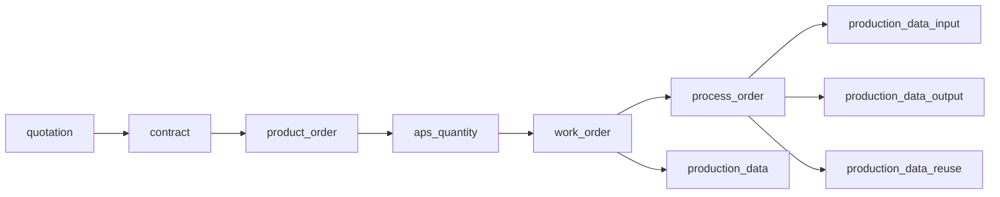
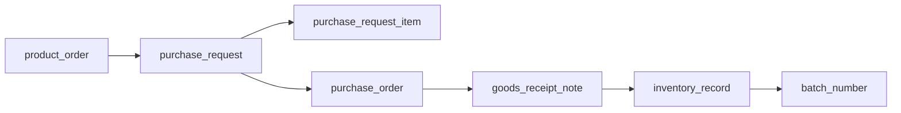
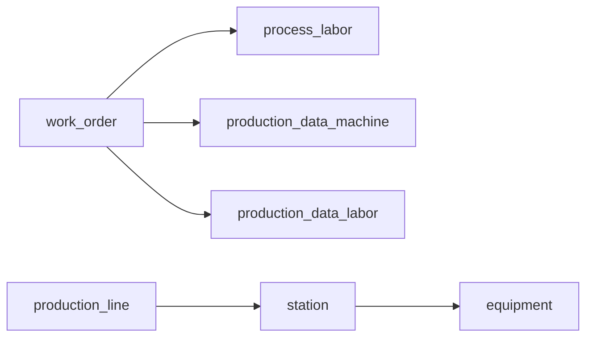

# EWDB Core Relationship Mapping

日期：2026-05-16  
來源：

- `docs/database/食品管理系統Database Schema_0.0.25.docx`
- `docs/database/EWDB_WORD_CONVERTED_SCHEMA_20260515_R01.sql`
- `docs/database/EWDB_WORD_INFERRED_FK_CANDIDATES_20260515.md`

## 1. 結論

R01 SQL 與 Word schema 已完成 table、field、data type 對齊。接下來進入 FK 與 workflow 關聯整理。

目前從 Word 描述推論出的 high FK 有 119 筆，但不建議全部一次套用。原因：

1. 有些欄位是 `VARCHAR(60)` 指向 `VARCHAR(20)` 的 business key，MySQL 通常可接受，但需要先確認 charset/collation 與目標欄位 unique。
2. 有些欄位型別不適合直接 FK，例如 `LONGTEXT` JSON Array。
3. 有些欄位雖然語意明確，但屬於統計表或帳款彙總表，可放到第二批。
4. 多目標欄位，例如 `item_no -> material / inproduct / product`，不能直接建立單一 FK。

本文件先定義 Phase 2 MVP 的核心閉環關係。

## 2. 建議 FK 策略

### Business Key Strategy

目前 EWDB 大量使用 `no` 作為業務編號與關聯欄位。

短期建議：

- 保留 `id` 作技術 PK。
- 保留 `no` 作 business key。
- 第一階段 FK 先依 Word 語意指向 `no`。
- 所有被指向的 `no` 必須有 `UNIQUE KEY`。

中期建議：

- SQLAlchemy models 可同時保留 `id` relationship 與 `no` 查詢欄位。
- 新增 API 時不要把 `displayName` / `name` 當 FK，只作顯示快照或 join 結果。

## 3. 第一批核心 FK

這一批支援最重要的閉環：

訂單 -> 採購/生產 -> 派工 -> 報工 -> 庫存/批號 -> 出貨/物流

### Master Data

| From table | From field | To table | To field | 用途 | 狀態 |
|---|---|---|---|---|---|
| `member` | `user_no` | `employee` | `no` | 帳號對員工 | 可建 FK |
| `session` | `user_no` | `employee` | `no` | session 對員工 | 可建 FK |
| `trans_items` | `company_no` | `company` | `no` | 交易品項對客戶/廠商 | 可建 FK |
| `trans_items2` | `company_no` | `company` | `no` | 其他交易品項對客戶/廠商 | 可建 FK |
| `ship_wh` | `company_no` | `company` | `no` | 物流倉儲商對公司 | 可建 FK |
| `production_line` | `factory_no` | `factory` | `no` | 產線對廠區 | 可建 FK |
| `production_line` | `process_no` | `process` | `no` | 產線對製程 | 可建 FK |
| `station` | `productionline_no` | `production_line` | `no` | 站點對產線 | 可建 FK，但建議欄位改名為 `production_line_no` |
| `equipment` | `station_no` | `station` | `no` | 機具對站點 | 可建 FK |

### Item And BOM

| From table | From field | To table | To field | 用途 | 狀態 |
|---|---|---|---|---|---|
| `inproduct_bom_spec` | `inproduct_no` | `inproduct` | `no` | 在製品 BOM 規格 | 可建 FK |
| `product_ver` | `item_no` | `product` | `no` | 製成品版本 | 可建 FK |
| `product_spec` | `product_no` | `product` | `no` | 製成品規格 | 可建 FK |
| `product_bom_spec` | `product_no` | `product` | `no` | 製成品對 BOM 物料規格 | 可建 FK |
| `product_bom_spec` | `bom2_no` | `bom2_number` | `no` | 製成品對物料 BOM 編碼 | 可建 FK |
| `bom_item` | `bom_no` | `bom` | `no` | 商品配方項目 | 可建 FK |
| `bom_item` | `item_no` | `material` | `no` | 配方原物料 | 可建 FK |
| `bom1_number` | `bom_no` | `bom` | `no` | 原料 BOM 對商品配方 | 可建 FK |
| `bom1` | `parent_no` | `bom1_number` | `no` | 原料 BOM 階層 | 可建 FK |
| `bom2_number` | `bom_no` | `product` | `no` | 物料 BOM 對製成品 | 可建 FK |
| `bom2` | `parent_no` | `bom2_number` | `no` | 物料 BOM 階層 | 可建 FK |

### Order And Procurement

| From table | From field | To table | To field | 用途 | 狀態 |
|---|---|---|---|---|---|
| `quotation` | `creator_no` | `employee` | `no` | 報價建立人 | 可建 FK |
| `quotation` | `item_ref_no` | `company` | `no` | 報價客戶/廠商 | 可建 FK |
| `contract` | `ref_no` | `quotation` | `no` | 合約來源報價 | 可建 FK |
| `contract` | `creator_no` | `employee` | `no` | 合約建立人 | 可建 FK |
| `contract` | `item_ref_no` | `company` | `no` | 合約客戶/廠商 | 可建 FK |
| `product_order` | `creator_no` | `employee` | `no` | 訂購單建立人 | 可建 FK |
| `product_order` | `ref_no` | `contract` | `no` | 訂購單來源合約 | 可建 FK |
| `product_order` | `item_ref_no` | `company` | `no` | 訂購客戶/廠商 | 可建 FK |
| `product_order` | `item_no` | `trans_items` | `no` | 訂購交易品項 | 可建 FK |
| `shipping_order` | `product_order_no` | `product_order` | `no` | 銷貨單對訂購單 | 可建 FK |
| `purchase_request` | `product_order_no` | `product_order` | `no` | 請購來源訂單 | 可建 FK |
| `purchase_request_item` | `purchase_request_no` | `purchase_request` | `no` | 請購項目對請購單 | 可建 FK |
| `purchase_request_item` | `item_no` | `material` | `no` | 請購原物料 | 可建 FK |
| `purchase_order` | `purchase_request_no` | `purchase_request` | `no` | 採購單對請購單 | 可建 FK |
| `goods_receipt_note` | `purchase_order_no` | `purchase_order` | `no` | 進貨單對採購單 | 可建 FK |

### Production

| From table | From field | To table | To field | 用途 | 狀態 |
|---|---|---|---|---|---|
| `aps_quantity` | `product_order_no` | `product_order` | `no` | APS 對訂購單 | 可建 FK |
| `aps_quantity_item` | `product_order_no` | `product_order` | `no` | APS 料品對訂購單 | 可建 FK |
| `aps_quantity_item` | `item_no` | `material` | `no` | APS 投入料品 | 可建 FK |
| `work_order` | `creator_no` | `employee` | `no` | 派工單建立人 | 可建 FK |
| `work_order` | `product_order_no` | `product_order` | `no` | 派工單對訂購單 | 可建 FK |
| `work_order` | `aps_no` | `aps_quantity` | `no` | 派工單對 APS | 可建 FK |
| `work_order` | `product_no` | `product` | `no` | 派工產品 | 可建 FK |
| `work_order` | `customer_no` | `company` | `no` | 派工客戶 | 可建 FK |
| `work_order` | `production_line_no` | `production_line` | `no` | 派工產線 | 可建 FK |
| `process_order` | `work_order_no` | `work_order` | `no` | 領退餘廢產單對派工單 | 可建 FK |
| `process_labor` | `work_order_no` | `work_order` | `no` | 人員部署對派工單 | 可建 FK |
| `process_labor` | `employee_no` | `employee` | `no` | 人員部署對員工 | 可建 FK |
| `process_labor` | `station_no` | `station` | `no` | 人員部署對站點 | 可建 FK |
| `production_data` | `work_order_no` | `work_order` | `no` | 生產數據對派工單 | 可建 FK |
| `production_data` | `product_order_no` | `product_order` | `no` | 生產數據對訂購單 | 可建 FK |
| `production_data` | `product_no` | `product` | `no` | 生產產品 | 可建 FK |
| `production_data` | `production_line_no` | `production_line` | `no` | 生產產線 | 可建 FK |
| `production_data_output` | `work_order_no` | `work_order` | `no` | 產出數據對派工單 | 可建 FK |
| `production_data_output` | `process_order_no` | `process_order` | `no` | 產出數據對製程單 | 可建 FK |
| `production_data_input` | `work_order_no` | `work_order` | `no` | 投入數據對派工單 | 可建 FK |
| `production_data_input` | `process_order_no` | `process_order` | `no` | 投入數據對製程單 | 可建 FK |
| `production_data_reuse` | `work_order_no` | `work_order` | `no` | 餘廢料數據對派工單 | 可建 FK |
| `production_data_reuse` | `process_order_no` | `process_order` | `no` | 餘廢料數據對製程單 | 可建 FK |
| `production_data_machine` | `work_order_no` | `work_order` | `no` | 機具數據對派工單 | 可建 FK |
| `production_data_machine` | `equipment_no` | `equipment` | `no` | 機具數據對機具 | 可建 FK |
| `production_data_labor` | `work_order_no` | `work_order` | `no` | 人員數據對派工單 | 可建 FK |
| `production_data_labor` | `employee_no` | `employee` | `no` | 人員數據對員工 | 可建 FK |
| `production_data_labor` | `station_no` | `station` | `no` | 人員數據對站點 | 可建 FK |

### Inventory And Batch

| From table | From field | To table | To field | 用途 | 狀態 |
|---|---|---|---|---|---|
| `batch_number` | `creator_no` | `employee` | `no` | 批號建立人 | 可建 FK |
| `batch_number` | `item_ref_no` | `company` | `no` | 批號客戶/廠商 | 可建 FK |
| `inventory_order` | `creator_no` | `employee` | `no` | 出入庫單建立人 | 可建 FK |
| `inventory_order` | `item_ref_no` | `company` | `no` | 出入庫單客戶/廠商 | 可建 FK |
| `inventory_record` | `warehouse_no` | `ship_wh_alias` | `no` | 出入庫紀錄倉儲別名 | 可建 FK |
| `inventory_record` | `item_ref_no` | `company` | `no` | 出入庫紀錄客戶/廠商 | 可建 FK |
| `warehouse_record` | `batch_no` | `batch_number` | `no` | 倉租紀錄對批號 | 可建 FK |
| `warehouse_payment` | `batch_no` | `batch_number` | `no` | 倉租帳款對批號 | 可建 FK |

## 4. 暫不建立實體 FK 的關係

### 型別或語意不適合

| From table | From field | To table | To field | 原因 | 建議 |
|---|---|---|---|---|---|
| `company` | `received_id` | `payment` | `id` | `VARCHAR(60)` 指向 `BIGINT` | 改為 `received_payment_id BIGINT` 或改指向 `payment.no` |
| `company` | `paid_id` | `payment` | `id` | `VARCHAR(60)` 指向 `BIGINT` | 改為 `paid_payment_id BIGINT` 或改指向 `payment.no` |
| `contract` | `payment_id` | `payment` | `id` | `INT` 指向 `BIGINT UNSIGNED` | 型別改為 `BIGINT UNSIGNED` |
| `inventory_delta` | `in_ref_id` | `inventory_record` | `id` | Word 描述為 JSON Array，SQL 型別為 `LONGTEXT` | 不建 FK，改用關聯表或 JSON 驗證 |
| `inventory_delta` | `out_ref_id` | `inventory_record` | `id` | Word 描述為 JSON Array，SQL 型別為 `LONGTEXT` | 不建 FK，改用關聯表或 JSON 驗證 |

### 多目標 polymorphic 關係

| Field pattern | Example | 原因 | 建議 |
|---|---|---|---|
| `item_no` | `inventory_record.item_no` | 指向 `material / inproduct / product` | 短期保留 `item_type + item_no`，中期導入統一 `items` |
| `output_item_no` | `work_order.output_item_no` | 指向 `inproduct / product` | 短期應用層驗證 |
| `ref_no` | `inventory_record.ref_no` | 指向多種單據 | 使用 `ref_type + ref_no` |
| `specified_no` | `inventory_delta.specified_no` | 指向品項或批號 | 建議統一主檔或保留 polymorphic |

## 5. Workflow 閉環

### 訂單到生產

### 採購到入庫

### 生產報工

## 6. 下一步

建議下一步做兩件事：

1. 先執行 `EWDB_CORE_FK_MIGRATION_DRAFT_20260516.sql` 裡的 orphan validation query。
2. 若 validation 沒有孤兒資料，再把第一批 FK 轉成 Alembic migration。
