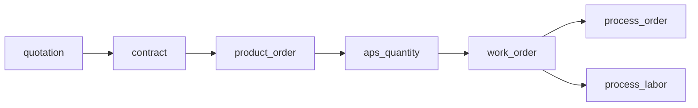
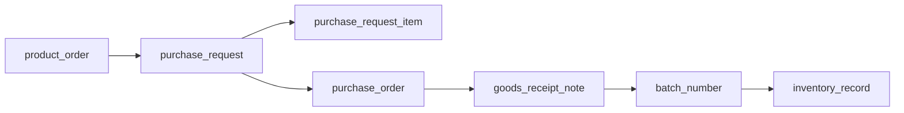
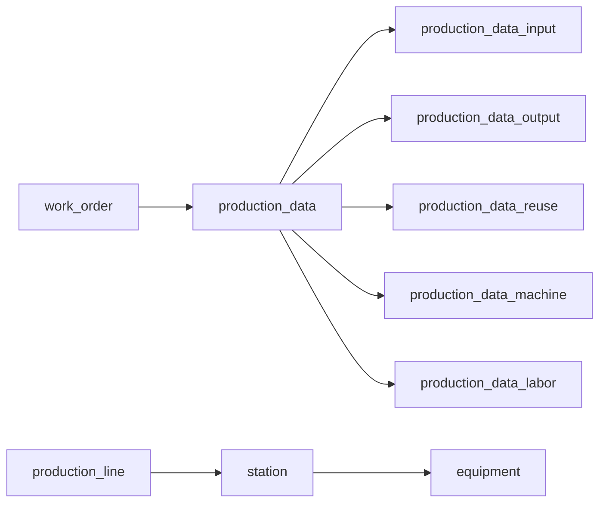

# EWDB Core Relationship Mapping

日期：2026-05-17
來源：

## 5. Workflow 閉環

### 訂單到生產

```mermaid
flowchart LR
  quotation --> contract
  contract --> product_order
  product_order --> aps_quantity
  aps_quantity --> work_order
  work_order --> process_order
  work_order --> process_labor
```

### 採購到入庫

```mermaid
flowchart LR
  product_order --> purchase_request
  purchase_request --> purchase_request_item
  purchase_request --> purchase_order
  purchase_order --> goods_receipt_note
  goods_receipt_note --> batch_number
  batch_number --> inventory_record
```

### 生產報工

```mermaid
flowchart LR 

  work_order --> production_data
  production_data --> production_data_input
  production_data --> production_data_output
  production_data --> production_data_reuse
  production_data --> production_data_machine
  production_data --> production_data_labor
  production_line --> station
  station --> equipment
```
